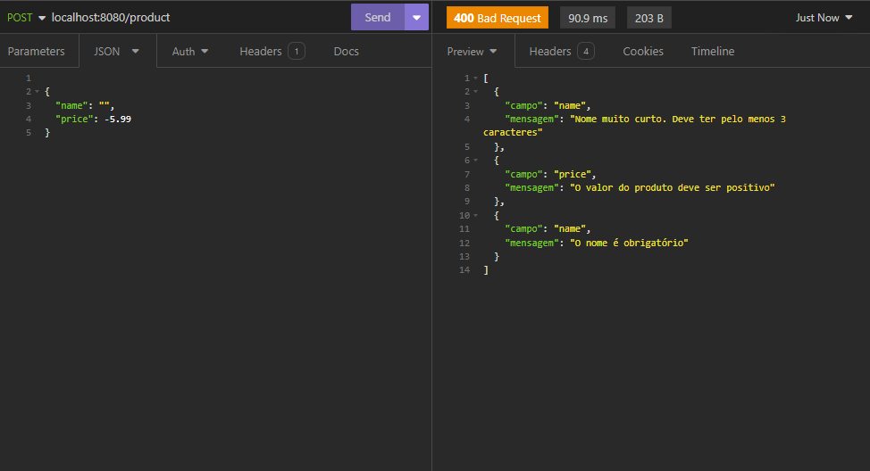

## Personal Buy - Challenge FIAP 2024

Repositório destinado ao projeto do Challenge de 2024 da FIAP, na matéria de Java Advanced da faculdade.

 A solução proposta é desenvolver uma inteligência artificial (IA) alimentada por algoritmos avançados de aprendizado de máquina e análise de dados. Este sistema será capaz de coletar e analisar grandes volumes de dados de compra, incluindo histórico de compras, preferências de produtos, comportamento de navegação e até mesmo informações demográficas e contextuais.

 Com base nessa análise, o sistema será capaz de gerar ofertas personalizadas para cada cliente, adaptadas às suas preferências individuais e comportamento de compra passado. Isso pode incluir descontos em produtos relevantes, sugestões de produtos complementares ou pacotes promocionais exclusivos. Além disso, o sistema será capaz de ajustar dinamicamente suas recomendações com base em interações em tempo real, como itens adicionados ao carrinho ou pesquisas recentes.

Benefícios Esperados:
- Aumento do faturamento: Oferecer ofertas personalizadas aumentará as taxas de conversão e o valor médio do pedido, resultando em um aumento significativo no faturamento da empresa.

- Melhor experiência do cliente: Os clientes se sentirão mais valorizados e compreendidos, aumentando a fidelidade à marca e a satisfação geral do cliente.

- Eficiência operacional: Automatizar o processo de recomendação de ofertas reduzirá a carga de trabalho manual e liberará recursos para outras áreas estratégicas do negócio.

## Integrantes

Igor Miguel Silva: Desenvolvedor back-end

João Pedro Costa Feitosa: Administrador do banco de dados

Kaue Matheus Santana: Desenvolvedor Machine Learning e QA

Gustavo René Dias Boamorte: Desenvolvedor .NET

Pedro Felipe Barros da Silva: Desenvolvedor Mobile

## Cronograma de Desenvolvimento

| Desenvolvedor | Data |  Tarefa
|--------|------|:-------------:|
Igor | 07/04 | Criação Controller Client
João | 08/04 | Criação Product Model
Kaue | 09/04 | Criação Compra Model
Kaue | 10/04 | Readme - endpoint client
João | 11/04 | Diagrama de entidades
Igor | 13/04 | Refatoração de entidades
Igor | 14/04 | Finalização projeto - sem validação
Igor | 15/04 | Implementação de validação
Igor | 15/04 | Finalização de validação
Igor | 15/04 | Finalização da documentação
Igor | 16/05 | Relacionamento
Igor | 17/05 | DatabaseSeeder e inserir Swagger
Igor | 18/05 | DatabaseSeeder completo
Igor | 20/05 | Paginação
Igor | 20/05 | Cache e Swagger completo


## Diagramas e arquitetura


## Video explicativo
[[Video Pitch]](https://www.youtube.com/watch?v=UZNU6DygUj8)

 ## Documentação
Para acessar a documentação no Swagger, basta rodar a aplicação e acessar a URL abaixo
 ```
localhost:8080/doc-personalbuy
```

 ### Endpoints

### Client

`GET` /client - Retorna um array com todas os clientes cadastrados.

`POST` /client - Cadastrar um novo usuário com os dados enviados no corpo da requisição.

`GET` /client/`{id}` - Retorna os dados detalhados do client com o `id` informado no parametro de path.

`DELETE` /client/ `{id}` - Apaga o client indicado pelo `id` enviado no parametro de path. 

`PUT` /client/`{id}` - Atualizar os dados do cliente com o `id` informado no path, utilizando os novos dados enviados no corpo da requisição.

```js
{
	"name": "Tamires Alves",
	"cpf": "123.456.789-90",
	"email": "tamialves@gmail.com.br",
	"phone":"(11) 91234-5678",
	"adress": "Rua Pesadelo Java, 777",
	"city": "Sâo Paulo",
	"state": "SP",
	"cep": "12345-678"
}
```

##### Exemplos de validações da requisição


### Product

`GET` /product - Retorna um array com todos os produtos cadastrados.

`POST` /product - Cadastrar um novo produto com os dados enviados no corpo da requisição.

`GET` /product/`{id}` - Retorna os dados detalhados do produto com o `id` informado no parametro de path.

`DELETE` /product/ `{id}` - Apaga o produto indicado pelo `id` enviado no parametro de path. 

`PUT` /product/`{id}` - Atualizar os dados do produto com o `id` informado no path, utilizando os novos dados enviados no corpo da requisição.

```js
{
	"name": "Mouse Gamer",
	"price": 45.99
	"productCategory": 1
}
```
##### Exemplos de validações da requisição



### Buy

`GET` /buy - Retorna um array com todos as compras cadastradas.

`POST` /buy - Cadastrar uma nova compra com os dados enviados no corpo da requisição.

`GET` /buy/`{id}` - Retorna os dados detalhados da compra com o `id` informado no parametro de path.

`DELETE` /buy/ `{id}` - Apaga a compra indicado pelo `id` enviado no parametro de path. 

`PUT` /buy/`{id}` - Atualizar os dados da compra com o `id` informado no path, utilizando os novos dados enviados no corpo da requisição.

```js
{
	"client": "1",
	"datePurchase": "2023-10-10",
	"purchaseStatus": "Em transito",
	"totalPurchaseValue": 21.99
}
```

##### Exemplos de validações da requisição


### Product Category

`GET` /productCategory - Retorna um array com todos as categorias de produtos cadastradas.

`POST` /productCategory - Cadastrar uma nova categoria de produto com os dados enviados no corpo da requisição.

`GET` /productCategory/`{id}` - Retorna os dados detalhados da categoria do produto com o `id` informado no parametro de path.

`DELETE` /productCategory/ `{id}` - Apaga a categoria do produto indicado pelo `id` enviado no parametro de path. 

`PUT` /productCategory/`{id}` - Atualizar os dados da categoria do produto com o `id` informado no path, utilizando os novos dados enviados no corpo da requisição.

```js
{
	"name": "Mouses"
}
```

##### Exemplos de validações da requisição


### Purchased Itens

`GET` /purchasedItens - Retorna um array com todos os produtos comprados de produtos cadastradas.

`POST` /purchasedItens - Cadastrar novos produtos comprados com os dados enviados no corpo da requisição.

`GET` /purchasedItens/`{id}` - Retorna os dados detalhados dos produtos comprados com o `id` informado no parametro de path.

`DELETE` /purchasedItens/ `{id}` - Apaga os produtos comprados indicado pelo `id` enviado no parametro de path. 

`PUT` /purchasedItens/`{id}` - Atualizar os dados dos produtos comprados com o `id` informado no path, utilizando os novos dados enviados no corpo da requisição.

```js
{
	"product": "1",
	"buy": "3",
	"quantityItens": 5,
	"unityPrice": 10.99
}
```

##### Exemplos de validações da requisição


### Como rodar a aplicação:

- Clone o repositório: Abra o navegador da web e acesse o GitHub. Encontre o repositório do projeto que deseja clonar e clique no botão "Clone" para obter a URL do repositório.

- Abra o Git Bash ou outro cliente Git de sua preferência e execute o comando para clonar o repositório

- Abra o projeto: Navegue até o diretório onde o projeto foi clonado em seu sistema de arquivos.

- Configure o ambiente: Verifique se você tem o Java JDK e o Maven instalados em sua máquina. Se não estiverem instalados, baixe e instale-os nos sites oficiais do Java e do Maven.

- Build do projeto: Abra o projeto em sua IDE Java favorita (por exemplo, IntelliJ IDEA, Eclipse, etc.). Certifique-se de que a IDE esteja configurada corretamente para reconhecer um projeto Maven.

- Dentro da IDE, localize o arquivo de configuração do banco de dados (normalmente application.properties ou application.yml) e verifique as configurações de banco de dados. Certifique-se de que o banco de dados H2 esteja configurado corretamente.

- Execute o projeto: Dentro da IDE, execute a classe principal do projeto, nomeada como CmgApplication. Isso iniciará o servidor Spring Boot.

- Acesse o console H2: Abra um navegador da web e digite o seguinte URL para acessar o console H2:
`http://localhost:8080/h2-console`
- Isso abrirá a interface do console H2. Insira as informações de conexão do banco de dados conforme configurado no arquivo de propriedades:
```
JDBC URL: jdbc:h2:mem:personalBuy
Username: sa
Password: (deixe em branco)
```

- Após preencher as informações, clique no botão "Connect" para acessar o console H2 e visualizar o banco de dados.

 - Acesse a aplicação: Após iniciar o servidor, você pode acessar a aplicação em um navegador da web digitando http://localhost:8080 na barra de endereço.

